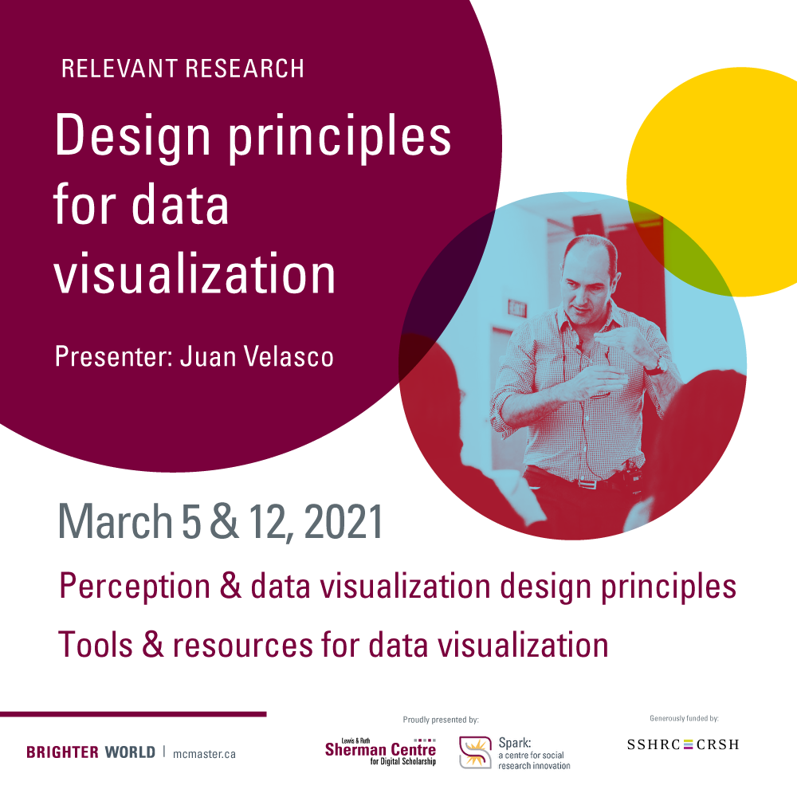

<!-- Edit the content below for the workshop in question. Once you're ready to publish, remove the comment characters e.g. "<!--" at the start and end -->

# Design Principles for Data Visualization 
<!--**A Relevant Research Series workshop prepared by [Juan Velasco](https://www.5wgraphics.com/en/about-us.php), Founder and Director of [5W Infographics](https://www.5wgraphics.com/).**-->

Juan Velasco, Founder and Creative Director of 5W Infographics, delivers a workshop series on data visualization. In the first session, Velsaco explains the importance of design in data visualization. This includes an introduction to visual perception principles which will ensure the creation of accessible and visually appealing data visualizations. In the second session, participants will have the opportunity to practice applying their newfound design skills using visualization platforms like Tableau, Datawrapper, and Flourish.

By the end of this workshop series, participants will be able to: 

1. Apply design principles to the creation of data visualizations

2. Use data visualization platforms (Tableau, Datawrapper, Flourish, etc.) to create visually appealing and accessible visualizations

Proceed to the [preperation instructions](preparation) to get started.

***Juan Velasco is a visual journalist with a long career focused in visualizing complex research and scientific information to make it understandable and engaging for large audiences. He was the Art Director of National Geographic magazine from 2005 to 2014, and the Graphics Art Director of The New York Times from 1996 to 2001. In 2001 he founded his own company, 5W Infographics (based in Washington DC, New York City and Madrid) which provides graphics, data visualization, motion graphics, and information design training and consulting for organizations all over the world. Juan has won over fifty Society of News Design and Infographics Malofiej awards - including the Best of Show Award in 2013 - as well as awards from the Society of Publication Design and the American Institute of Graphic Arts. He was also a Pulitzer Prize finalist as part of a team of writers and visual journalists working for the New York Times.***
